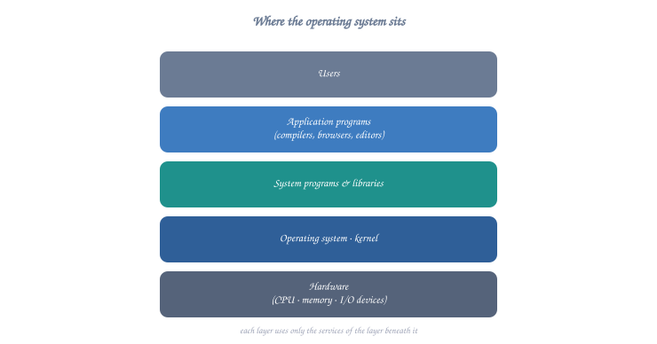
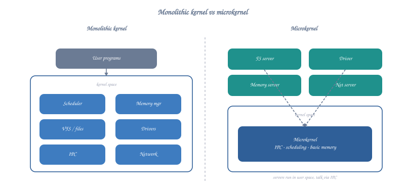
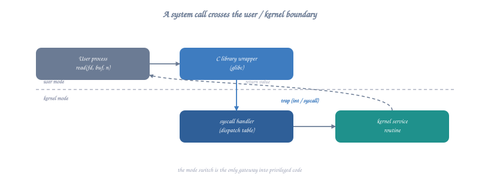
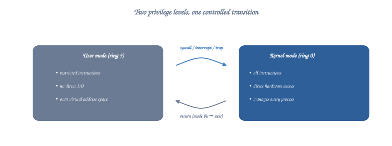

# Operating Systems - Introduction and Fundamentals

## Table of Contents
1. [What is an Operating System?](#what-is-an-operating-system)
2. [Analogy & Beginner Intuition](#analogy--beginner-intuition)
3. [Goals and Functions](#goals-and-functions)
4. [Types of Operating Systems](#types-of-operating-systems)
5. [Operating System Structure](#operating-system-structure)
6. [Hardware Support & Privilege Rings](#hardware-support--privilege-rings)
7. [System Calls & Low-Level Register Flow](#system-calls--low-level-register-flow)
8. [Operating System Services](#operating-system-services)
9. [Kernel Concepts](#kernel-concepts)
10. [Boot Process](#boot-process)
11. [Interrupts and Traps](#interrupts-and-traps)
12. [Review Questions & Answers](#review-questions--answers)

---

## What is an Operating System?

An **Operating System (OS)** is system software that acts as an intermediary between computer hardware and the computer user. It manages hardware resources and provides services for application software.

---

## Analogy & Beginner Intuition

> [!NOTE]
> **Everyday Analogy: The Restaurant Manager & Waiter**
> Imagine a busy restaurant:
> - **Hardware** (CPU, RAM, Disks) is the **Kitchen** (Chefs, Ovens, Ingredients).
> - **User Applications** (Web Browser, Games) are the **Customers** sitting at dining tables.
> - The **Operating System** is the **Restaurant Manager & Waiter**.
>
> Customers cannot walk directly into the kitchen and grab raw ingredients or use the oven—that would cause chaos, accidents, and ruined food. Instead, customers look at a **Menu** (the **System Call Interface**) and place an order with the **Waiter** (the **Kernel**). The waiter takes the request to the kitchen, ensures resources are allocated fairly, enforces hygiene and safety rules (security & isolation), and brings back the cooked dish (results).

### Why Do We Need an OS?
1. **Abstraction**: Applications don't need to know if your storage is an NVMe SSD or an old spinning hard disk; the OS provides a universal concept called a "File".
2. **Protection & Isolation**: A buggy game shouldn't be able to crash your word processor or read your banking passwords from memory.
3. **Resource Sharing**: If 10 apps are running on a 4-core CPU, the OS multiplexes time so all 10 apps appear to run simultaneously.

### ASCII Diagram: OS Position in Computer System



<details class="ascii-diagram">
<summary>ASCII diagram</summary>
<pre><code>
+----------------------------------------------------------+
|                     USER APPLICATIONS                    |
|    (Web Browser, Text Editor, Games, Database, etc.)     |
+----------------------------------------------------------+
|                   APPLICATION PROGRAMS                   |
|           (Compilers, Assemblers, Text Editors)          |
+----------------------------------------------------------+
|                    OPERATING SYSTEM                      |
|  +----------------------------------------------------+  |
|  | System Calls Interface                             |  |
|  +----------------------------------------------------+  |
|  | Kernel                                             |  |
|  | - Process Management  - Memory Management          |  |
|  | - File System        - I/O Management              |  |
|  | - Security           - Networking                  |  |
|  +----------------------------------------------------+  |
+----------------------------------------------------------+
|                    COMPUTER HARDWARE                     |
|    CPU  |  Memory  |  Disks  |  I/O Devices  |  etc.     |
+----------------------------------------------------------+
</code></pre>
</details>

---

## Goals and Functions

### Primary Goals

1. **Convenience**: Make the computer system convenient to use
2. **Efficiency**: Use hardware resources efficiently
3. **Ability to Evolve**: Permit effective development, testing, and introduction of new system functions

### Core Functions

#### 1. Resource Management
- **CPU Management**: Allocate processor time to processes
- **Memory Management**: Manage RAM allocation
- **Device Management**: Control I/O devices
- **File Management**: Organize and access files

#### 2. Process Management
- Process creation and deletion
- Process scheduling
- Process synchronization
- Process communication
- Deadlock handling

#### 3. Memory Management
- Keep track of memory usage
- Allocate and deallocate memory
- Decide which processes to load into memory

#### 4. File System Management
- File creation and deletion
- Directory creation and deletion
- Support for file manipulation
- Mapping files to secondary storage
- Backup files

#### 5. I/O System Management
- Memory management for I/O (buffering, caching, spooling)
- General device-driver interface
- Drivers for specific hardware devices

---

## Types of Operating Systems

### 1. Batch Operating Systems

**Characteristics:**
- Jobs are batched together and processed sequentially
- No direct interaction between user and computer
- Used in mainframe systems

```
Job Queue:
+-------+     +-------+     +-------+     +-------+
| Job 1 | --> | Job 2 | --> | Job 3 | --> | Job 4 |
+-------+     +-------+     +-------+     +-------+
    |
    v
+------------------+
| Batch Processor  |
+------------------+
    |
    v
+------------------+
|  Output Queue    |
+------------------+
```

**Advantages:**
- Efficient processing of large volumes of data
- Reduced idle time

**Disadvantages:**
- Lack of user interaction
- Difficult to debug

### 2. Time-Sharing Operating Systems (Multitasking)

**Characteristics:**
- CPU time is shared among multiple users/processes
- Each user gets a small time slice (quantum)
- Creates illusion of dedicated system for each user

```
Time Quantum = 100ms

Time:  0      100    200    300    400    500    600
       |------|------|------|------|------|------|
CPU:   | P1   | P2   | P3   | P1   | P2   | P3   |
       |------|------|------|------|------|------|

Legend: P1, P2, P3 = Different Processes
```

**Examples:** UNIX, Linux, Windows

**Advantages:**
- Quick response time
- Reduces CPU idle time
- Multiple users can work simultaneously

**Disadvantages:**
- Security and integrity issues
- Higher overhead

### 3. Real-Time Operating Systems (RTOS)

**Characteristics:**
- Time constraints are critical
- Must respond to inputs within guaranteed time limits
- Used in time-critical systems

**Types:**

**a) Hard Real-Time Systems**
- Strict time constraints
- Missing deadline is system failure
- Examples: Air traffic control, Medical systems, Nuclear reactors

**b) Soft Real-Time Systems**
- Less strict time constraints
- Missing occasional deadline is tolerable
- Examples: Multimedia systems, Video streaming

```
Hard Real-Time:
Event -----> |Response| <-- Must complete within deadline
             +---------+
             | Process |
             +---------+
                 |
                 v
            [DEADLINE] <-- MUST meet this
                 |
                 X (Failure if missed)

Soft Real-Time:
Event -----> |Response| <-- Should complete soon
             +---------+
             | Process |
             +---------+
                 |
                 v
            [DEADLINE] <-- SHOULD meet this
                 |
                 ~ (Degraded performance if missed)
```

### 4. Distributed Operating Systems

**Characteristics:**
- Multiple CPUs connected through network
- Resources are shared
- Appears as single system to users

```
Site A                  Site B                  Site C
+-------+              +-------+              +-------+
| CPU   |              | CPU   |              | CPU   |
| Mem   |              | Mem   |              | Mem   |
| Disk  |              | Disk  |              | Disk  |
+-------+              +-------+              +-------+
    |                      |                      |
    +----------------------+----------------------+
                    NETWORK
              (High-Speed Communication)
```

**Advantages:**
- Resource sharing
- Computation speedup
- Reliability and fault tolerance
- Communication

### 5. Network Operating Systems

**Characteristics:**
- Computers connected through network
- Each computer aware of other computers
- Users explicitly access remote resources

```
Server                          Clients
+----------+                +----------+  +----------+
| Network  |                | Local OS |  | Local OS |
| Services |                | + Network|  | + Network|
| - Files  |<-------------->| Client   |  | Client   |
| - Print  |    Network     +----------+  +----------+
| - Auth   |                
+----------+               +----------+  +----------+
                           | Local OS |  | Local OS |
                           | + Network|  | + Network|
                           | Client   |  | Client   |
                           +----------+  +----------+
```

### 6. Mobile Operating Systems

**Characteristics:**
- Designed for mobile devices
- Touch-based interfaces
- Power management is critical
- App-based architecture

**Examples:** Android, iOS, HarmonyOS

---

## Operating System Structure

### 1. Simple Structure (MS-DOS)

MS-DOS was written to provide the most functionality in the least space.

```
+------------------------+
|   Application Program  |
+------------------------+
| Resident System Program|
+------------------------+
|    MS-DOS Drivers      |
+------------------------+
|    ROM BIOS Drivers    |
+------------------------+
```

**Characteristics:**
- No clear separation between interfaces and levels
- Vulnerable to malicious programs
- Limited functionality

### 2. Monolithic Structure (Traditional UNIX)

Everything runs in kernel mode with full access to hardware.



<details class="ascii-diagram">
<summary>ASCII diagram</summary>
<pre><code>
                 User Mode
+--------------------------------------------------+
|  Users  |  Shells  |  Applications  |  Compilers |
+--------------------------------------------------+
              System Call Interface
+--------------------------------------------------+
|               KERNEL MODE                        |
|  +--------------------------------------------+  |
|  |  File System  |  CPU Scheduling            |  |
|  |  Memory Mgmt  |  Signal Handler            |  |
|  |  Networking   |  Device Drivers            |  |
|  +--------------------------------------------+  |
+--------------------------------------------------+
|            Hardware Abstraction Layer           |
+--------------------------------------------------+
|                   HARDWARE                       |
+--------------------------------------------------+
</code></pre>
</details>

**Advantages:**
- Fast execution (no message passing overhead)
- Direct access to hardware

**Disadvantages:**
- Difficult to maintain and debug
- Poor isolation between components
- Kernel crash affects entire system

### 3. Layered Approach

OS is divided into layers, each built on top of lower layers.

```
Layer N:  User Programs
          +----------------------------------+
Layer 5:  User Programs Interface
          +----------------------------------+
Layer 4:  I/O Buffering
          +----------------------------------+
Layer 3:  Operator-Console Device Driver
          +----------------------------------+
Layer 2:  Memory Management
          +----------------------------------+
Layer 1:  CPU Scheduling
          +----------------------------------+
Layer 0:  Hardware
          +----------------------------------+
```

**Advantages:**
- Simplicity of construction and debugging
- Each layer uses functions of lower layers only
- Easy to enhance

**Disadvantages:**
- Careful planning required
- Performance overhead

### 4. Microkernel Structure

Moves as much functionality as possible from kernel to user space.

```
                    USER SPACE
+--------------------------------------------------+
|  File    |  Device  |  Window  |  Application    |
|  Server  |  Driver  |  System  |  Programs       |
+--------------------------------------------------+
           ^    ^    ^    ^    ^    ^
           |    |    |    |    |    |
    Message Passing (IPC - Inter-Process Comm.)
           |    |    |    |    |    |
           v    v    v    v    v    v
+--------------------------------------------------+
|              MICROKERNEL                         |
|  +--------------------------------------------+  |
|  | - Basic Process Management                 |  |
|  | - Low-level Memory Management              |  |
|  | - Inter-Process Communication (IPC)        |  |
|  | - Basic Scheduling                         |  |
|  +--------------------------------------------+  |
+--------------------------------------------------+
|                  HARDWARE                        |
+--------------------------------------------------+
```

**Examples:** Mach, QNX, Minix

**Advantages:**
- Easy to extend
- More secure and reliable
- Easier to port to new architectures

**Disadvantages:**
- Performance overhead due to message passing
- More complex implementation

### 5. Modular Structure (Modern Approach)

Kernel has core components, and other services are loaded dynamically.

```
+--------------------------------------------------+
|                 KERNEL CORE                      |
|    - Process Management                          |
|    - Memory Management                           |
|    - IPC                                         |
+--------------------------------------------------+
           ^              ^              ^
           |              |              |
    [Module Loader/Interface]
           |              |              |
           v              v              v
+-------------+  +-------------+  +-------------+
| File System |  |   Device    |  |  Network    |
|   Module    |  |   Drivers   |  |   Stack     |
+-------------+  +-------------+  +-------------+
        Loadable Kernel Modules (LKMs)
```

**Examples:** Linux, Modern Solaris

**Advantages:**
- Flexibility (modules can be loaded/unloaded)
- Similar performance to monolithic
- Better organized than pure monolithic

---

## System Calls

System calls provide an interface between a process and the operating system. They are the only means by which a user program can access kernel services.

### System Call Mechanism



<details class="ascii-diagram">
<summary>ASCII diagram</summary>
<pre><code>
         USER MODE
+---------------------------+
|   User Application        |
|   printf("Hello");        |
+---------------------------+
          |
          | (1) Library Call
          v
+---------------------------+
|   C Library (libc)        |
|   Prepare system call     |
+---------------------------+
          |
          | (2) Trap/Software Interrupt
          v
====================== MODE SWITCH ========================
          |
          v
        KERNEL MODE
+---------------------------+
|   System Call Handler     |
|   (Dispatcher)            |
+---------------------------+
          |
          | (3) Call appropriate service
          v
+---------------------------+
|   Kernel Service Routine  |
|   (e.g., write())         |
+---------------------------+
          |
          | (4) Return result
          v
====================== MODE SWITCH ========================
          |
          v
        USER MODE
+---------------------------+
|   User Application        |
|   (continues execution)   |
+---------------------------+
</code></pre>
</details>

### Types of System Calls

#### 1. Process Control
- `fork()` - Create a child process
- `exit()` - Terminate process
- `wait()` - Wait for child process
- `exec()` - Execute a program
- `kill()` - Send signal to process

#### 2. File Management
- `open()` - Open a file
- `close()` - Close a file
- `read()` - Read from file
- `write()` - Write to file
- `lseek()` - Reposition file pointer

#### 3. Device Management
- `ioctl()` - Control device
- `read()` - Read from device
- `write()` - Write to device

#### 4. Information Maintenance
- `getpid()` - Get process ID
- `time()` - Get system time
- `getuid()` - Get user ID

#### 5. Communication
- `pipe()` - Create pipe for IPC
- `socket()` - Create communication endpoint
- `send()`, `recv()` - Send/receive messages
- `shmget()` - Get shared memory segment

#### 6. Protection
- `chmod()` - Change file permissions
- `chown()` - Change file owner
- `setuid()` - Set user ID

### Example: Process Creation via System Calls

```
Parent Process                 Child Process
+-------------+
|   fork()    |
+-------------+
      |
      | System call
      v
  [KERNEL]
      |
      +--------> Creates copy
      |                |
      v                v
+-------------+  +-------------+
| Parent      |  | Child       |
| (fork()>0)  |  | (fork()=0)  |
+-------------+  +-------------+
      |                |
      v                v
  Continue          Execute
  execution         new task
```

---

## Operating System Services

### User-Oriented Services

```
                    USER
                      |
                      v
+--------------------------------------------------+
|  1. User Interface (UI)                          |
|     - CLI (Command Line Interface)               |
|     - GUI (Graphical User Interface)             |
|     - Batch Interface                            |
+--------------------------------------------------+
|  2. Program Execution                            |
|     - Load program into memory                   |
|     - Run the program                            |
|     - End execution (normal or abnormal)         |
+--------------------------------------------------+
|  3. I/O Operations                               |
|     - File I/O                                   |
|     - Device I/O                                 |
+--------------------------------------------------+
|  4. File System Manipulation                     |
|     - Read, write, create, delete files          |
|     - Search files and directories               |
|     - Permission management                      |
+--------------------------------------------------+
|  5. Communications                               |
|     - Inter-process communication (IPC)          |
|     - Network communication                      |
+--------------------------------------------------+
|  6. Error Detection                              |
|     - Hardware errors (CPU, memory, I/O)         |
|     - Software errors (overflow, illegal access) |
+--------------------------------------------------+
```

### System-Oriented Services

```
+--------------------------------------------------+
|  1. Resource Allocation                          |
|     - CPU scheduling                             |
|     - Memory allocation                          |
|     - Device allocation                          |
+--------------------------------------------------+
|  2. Accounting                                   |
|     - Track resource usage per user/process      |
|     - Usage statistics                           |
+--------------------------------------------------+
|  3. Protection and Security                      |
|     - Access control                             |
|     - User authentication                        |
|     - Defend against internal/external attacks   |
+--------------------------------------------------+
```

---

## OS Kernel

The **kernel** is the core component of an OS that has complete control over everything in the system.

### Kernel Types

```
1. MONOLITHIC KERNEL              2. MICROKERNEL
+-------------------+             +-------------------+
|                   |             | Minimal Kernel    |
|   All Services    |             +-------------------+
|   in Kernel       |                     |
|   - File System   |             User Space Services
|   - Drivers       |             +-------------------+
|   - Networking    |             | File    | Device  |
|   - Memory Mgmt   |             | System  | Drivers |
|   - IPC           |             +-------------------+
|                   |             | Network | Window  |
+-------------------+             | Stack   | System  |
                                  +-------------------+

3. HYBRID KERNEL                  4. EXOKERNEL
+-------------------+             +-------------------+
| Microkernel Core  |             | Minimal Resource  |
| + Some Services   |             | Multiplexing      |
| in Kernel         |             +-------------------+
|                   |                     |
| User Space        |             Application-Level
| +---------------+ |             Resource Management
| | Some Services | |             +-------------------+
| +---------------+ |             | App-specific      |
+-------------------+             | Optimizations     |
                                  +-------------------+
```

### Kernel Mode vs User Mode



<details class="ascii-diagram">
<summary>ASCII diagram</summary>
<pre><code>
CPU Privilege Levels:

Ring 0 (Kernel Mode)
+--------------------------------+
| - Full hardware access         |
| - Execute privileged           |
|   instructions                 |
| - Direct memory access         |
| - Control I/O                  |
+--------------------------------+
         ^         |
         |         | System Calls
         |         | (Mode Switch)
         |         v
Ring 3 (User Mode)
+--------------------------------+
| - Limited access               |
| - Cannot execute privileged    |
|   instructions                 |
| - Restricted memory access     |
| - Request services via         |
|   system calls                 |
+--------------------------------+
</code></pre>
</details>

---

## Boot Process

The sequence of events that occurs when a computer is powered on:

```
Step 1: Power On
   |
   v
+------------------+
| BIOS/UEFI        |
| - POST (Power On |
|   Self Test)     |
+------------------+
   |
   v
Step 2: Boot Loader Location
+------------------+
| Find Boot Device |
| (Hard Disk, USB, |
| Network)         |
+------------------+
   |
   v
Step 3: Boot Loader
+------------------+
| GRUB/LILO        |
| - Display menu   |
| - Load kernel    |
+------------------+
   |
   v
Step 4: Kernel Loading
+------------------+
| Load Kernel into |
| Memory           |
| Initialize       |
| Hardware         |
+------------------+
   |
   v
Step 5: Init Process
+------------------+
| Start init/      |
| systemd (PID=1)  |
+------------------+
   |
   v
Step 6: User Space
+------------------+
| Start System     |
| Services         |
| Login Prompt     |
+------------------+
```

---

## Interrupts and Traps

### Interrupt Mechanism

```
CPU Executing Program A
        |
        | (1) Interrupt occurs (e.g., I/O completion)
        v
+------------------+
| Save state of    |
| Program A        |
| (PC, registers)  |
+------------------+
        |
        | (2) Transfer control
        v
+------------------+
| Interrupt Vector |
| Table            |
+------------------+
        |
        | (3) Jump to ISR
        v
+------------------+
| Interrupt Service|
| Routine (ISR)    |
| Handler          |
+------------------+
        |
        | (4) Handle interrupt
        v
+------------------+
| Restore state of |
| Program A        |
+------------------+
        |
        | (5) Resume
        v
CPU Resumes Program A
```

### Types of Interrupts

1. **Hardware Interrupts**
   - Generated by hardware devices
   - Examples: Keyboard input, timer tick, disk I/O completion

2. **Software Interrupts (Traps)**
   - Generated by software
   - System calls
   - Exceptions (division by zero, page fault)

```
Interrupt Priority:
High  ┌─────────────────┐
      │ Machine Check   │
      ├─────────────────┤
      │ Clock/Timer     │
      ├─────────────────┤
      │ Disk I/O        │
      ├─────────────────┤
      │ Network         │
      ├─────────────────┤
      │ Keyboard        │
      ├─────────────────┤
      │ Software Int    │
Low   └─────────────────┘
```

---

## Hardware Support & Privilege Rings

Modern CPUs provide hardware mechanisms to enforce dual-mode operation and memory protection:

1. **Privilege Levels (Rings)**:
   - x86 architecture defines 4 privilege rings (Ring 0 to Ring 3).
   - **Ring 0 (Supervisor / Kernel Mode)**: Unrestricted access to hardware, I/O ports, and control registers.
   - **Ring 3 (User Mode)**: Restrictive execution. Attempting privileged instructions triggers a General Protection Fault (`#GP`).
2. **CPU Registers for Mode Control**:
   - `CS` (Code Segment Register): The lowest 2 bits determine Current Privilege Level (`CPL`). `00` = Ring 0, `11` = Ring 3.
   - `CR3` (Control Register 3): Points to the base physical address of the current page directory/table.
   - `EFLAGS` / `RFLAGS`: Contains system flags like `IF` (Interrupt Flag).

```
x86 Privilege Rings:
┌─────────────────────────────────────────┐
│ Ring 3: User Applications               │
│  ┌───────────────────────────────────┐  │
│  │ Ring 2: Device Drivers (Unused)   │  │
│  │  ┌─────────────────────────────┐  │  │
│  │  │ Ring 1: OS Services (Unused)│  │  │
│  │  │  ┌───────────────────────┐  │  │  │
│  │  │  │ Ring 0: OS Kernel     │  │  │  │
│  │  │  └───────────────────────┘  │  │  │
│  │  └─────────────────────────────┘  │  │
│  └───────────────────────────────────┘  │
└─────────────────────────────────────────┘
```

---

## System Calls & Low-Level Register Flow

When a user process executes a system call like `write(1, "Hello", 5)`, the following low-level sequence occurs:

```
User Mode (Ring 3)                               Kernel Mode (Ring 0)
┌─────────────────────────┐                      ┌───────────────────────────────┐
│ Application calls       │                      │ Kernel Syscall Handler        │
│ write(fd, buf, count)   │                      │ (e.g., sys_write)             │
└────────────┬────────────┘                      └───────────────▲───────────────┘
             │                                                   │
             v                                                   │
┌─────────────────────────┐                                      │
│ C Library (libc) wrapper│                                      │
│ - Store syscall # in RAX│                                      │
│ - Store args in RDI,    │                                      │
│   RSI, RDX              │                                      │
└────────────┬────────────┘                                      │
             │                                                   │
             v                                                   │
┌─────────────────────────┐    Hardware Exception/Trap           │
│ Execute `syscall`       ├──────────────────────────────────────┘
│ (or `int 0x80`)         │  - Switch CS:CPL from 3 to 0
└─────────────────────────┘  - Save User RSP/RIP to Kernel Stack
                             - Jump to address in IA32_LSTAR MSR
```

---

## Review Questions & Answers

### Question 1: What is the primary difference between a trap and a hardware interrupt?
**Answer**: A **trap** (or software interrupt) is synchronous and caused by the currently executing instruction (e.g., system call, divide-by-zero, page fault). A **hardware interrupt** is asynchronous and generated by an external hardware device (e.g., keyboard input, network packet arrival, timer tick).

### Question 2: Why must the CPU hardware switch mode bits when entering kernel mode?
**Answer**: If mode bits were not enforced by hardware, user applications could bypass privilege restrictions, directly manipulate memory belonging to other applications or the kernel, access I/O ports, or disable timer interrupts, breaking security and stability.

---

## Summary

- Operating systems act as intermediaries between hardware and users.
- Core functions: Process management, memory management, file systems, I/O.
- Various types: Batch, Time-sharing, Real-time, Distributed, Network, Mobile.
- Structures: Monolithic, Layered, Microkernel, Modular.
- System calls provide interface for user programs to access kernel services.
- Kernel operates in privileged mode with full hardware access.
- Boot process initializes hardware and starts OS.
- Interrupts allow hardware and software to signal the CPU for attention.

---

**Next Topics:**
- Process Management
- Memory Management
- CPU Scheduling
- File Systems


